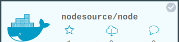

dockeri.co
==========

Badges for Docker

Usage
===

`docker run -dP crackerz/dockerico`

Assuming this starts on port 49153

`wget 127.0.0.1:49153/image/nodesource/node`

Will result in the badge above.
